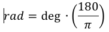

# Geospatial Benchmarks for MySQL
## Table of Contents

## Overview
This Go app provides a light framework for doing time comparisons of various
methods for calculating distance between two points on Earth, using MySQL 
builtin functions.

# Methodology
Calculating distance across the Earth requires using spherical geometry. The
generally accepted computational method is to use the Great Circle formula. This
section discusses the math and associated code to perform Great Circle 
calculations.  

The code is written in Go and MySQL.  But it is trivial to port the code to any
language that has at least a rudimentary math library.

## Degrees to Radians
The functions are circle geometry, and are thus performed in radians.  Yet latitude and longitude are
calculated as degrees.  Thus, the degree based latitude and longitude values 
must be converted into radians, using the following function:



Computationally, this looks like the following:

```go
func rad(deg float64) float64 {
	return deg * math.Pi / 180
}
```
## Haversine Formula
Calculating "Great Circle" distances between two latitude/longitude points is
performed using variations of the Haversine formula (haversine).   

The Great Circle distance function is as follows: 


where the haversine function (hav) is as follows:


Computationally, the resulting haversine function looks like:
```go
func hav(theta float64) float64 { 
   math.Pow(math.Sin(theta/2), 2)
}
```
Or, using the cosine variant:
```go
func hav(theta float64) float64 { 
   return .5 * (1 - math.Cos(theta))
}
```
And the distance formula becomes as follows:
```go
func distance(lon, lat, tlon, tlat float64) float64 {
   R := 6371.0 // Earth's radius in kilometers
   return R * 2 * math.Asin(
      math.Sqrt(
         hav(tlat-lat) + math.Cos(lat)*math.Cos(tlat)*hav(tlon-lon)))
}
```
## Law of Cosines
The above Great Circle distance formaula can be simplified by taking into 
consideration the law of cosines.  The resulting formula then becomes:

```go
func distance(lon, lat, tlon, tlat float64) float64 {
   R := 6371.0 // Earth's radius in kilometers
	return R *
		math.Acos(
			math.Sin(lat) * math.Sin(tlat) +
			math.Cos(lat) * math.Cos(tlat) *
			math.Cos(lon-tlon) )
}

func main() {
   lon := rad(11.3750514) 
   lat := rad(47.2604910)
   tlon := rad(11.8686483)
   tlat := rad(47.2261598)
   fmt.Printf("Distance in kilometers: %f\n", distance(lon, lat, tlon, tlat))
}
```

which would produce the following:

```
Distance in kilometers: 37.455971
```
## Miles vs kilometers
The above functions are kilometer based, and use `R := 6371.0` as the Earth's 
radius. This can easily be calculated in miles by using `R := 3950.0`.

## MySQL Version of Great Distance function
There are two basic options for calculating distance in MySQL.  Either express
the Great Circle distance formula in the query, or if you are using v5.7 or 
greater, you can use the Spatial functions.  Following demonstrate both version.

### Inline
Assuming the latitude and longitude degrees have been converted to radians, 
the SQL for Law of Cosines version of the Great Distance formula as as follows:

```SQL
SELECT cols, 
   ( 6371 * ACOS( SIN( tlat ) * SIN( lat ) +  COS( tlat ) * COS( lat ) * COS( lon - tlon ))
   AS distance FROM my_table;
```
The latitude and longitude degrees can, of course be converted using SQL 
functions:

```SQL
SELECT cols, 
   (6371 * ACOS( SIN( RADIANS(tlat) ) * SIN( RADIANS(lat) ) +  COS( RADIANS(tlat) ) * COS( RADIANS(lat) ) * COS( RADIANS(lon) - RADIANS(tlon) ) )
   AS distance from my_table;
```
### Spatial functions
The built in Spatial function `st_disance_sphere` in MySQL 5.7 and greater now 
uses spherical geometry (Great Circle). The Spatial functions take values of
type `GEOMETRY`, of which `POINT` is one.  Thus, latitude and longitude values
must be provided as POINTs. You can opt to do this as part of the query, as 
shown below.

The function returns distance in meters, rather than kilometers. So, simply 
multiply by `1000` to get equivilant values.

```SQL
SELECT id, (st_distance_sphere(POINT(lon, lat), POINT(tlon, tlat) )/1000) AS distance FROM my_table;
```
# The Benchmarks

## Setup
### Install the app
```sh
> go get github.com/dskyberg/geospatial
```
### Download the test data
You can use any of the collections from the [OpenAddresses download site](http://results.openaddresses.io)
> wget https://s3.amazonaws.com/data.openaddresses.io/openaddr-collected-europe.zip
> unzip openaddr-collected-europe.zip