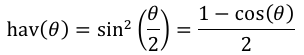

# Geospatial Benchmarks for MySQL
## Overview
This Go app provides a light framework for doing time comparisons of various
methods for calculating distance between two points on Earth, using MySQL 
builtin functions.

## Haversine Formula
Calculating "Great Circle" distances between two latitude/longitude points is
performed using variations of the Haversine formula (haversine). Haversine 
calculates two points across the surface of a three dimentional sphere, rather than 
across a two dimentional plane.  

The formula is as follows: 

